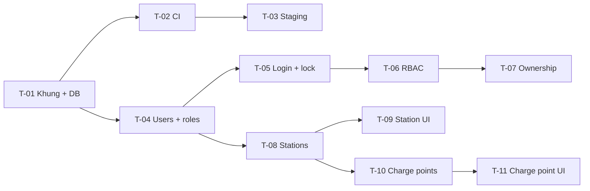

# Kế hoạch thực hiện Sprint 1

Sprint dài 5 ngày. Các hạng mục được xếp theo dependency trong `Tasks.xlsx`.

## Trình tự

## Phân bổ theo ngày

| Ngày | Mục tiêu | Tiêu chí kết thúc |
| --- | --- | --- |
| 1 | T-01, bắt đầu T-04 | Compose chạy; migration up/down; 5 roles được seed |
| 2 | T-02, T-05 | CI xanh; login đúng/sai; khoá tồn tại qua restart |
| 3 | T-06, T-07, T-08 | Route chưa khai quyền trả 403; owner A không đọc station B |
| 4 | T-09, T-10, T-11 | CRUD station; thêm trụ và connectors; unique code ở DB |
| 5 | hoàn thiện T-03, regression, demo | health check; test xanh; demo chạy từ môi trường sạch |

K-01 chạy timebox 2 ngày bởi hai người sau khi T-01 ổn định, không chặn luồng CRUD trạm.

## Definition of Done chung

- Acceptance criteria liên quan có test tự động hoặc bước demo lặp lại được.
- Migration tiến và lùi sạch trên database trống.
- Không có secret trong repository hoặc log.
- `lint`, `typecheck`, `test`, `build` đều xanh.
- README có lệnh chạy từ máy mới.
- Thay đổi có pull request và ít nhất một người review.

## Kịch bản demo Sprint 1

1. Khởi động từ môi trường sạch bằng Docker Compose.
2. Đăng nhập sai 5 lần; lần thứ 6 cho thấy tài khoản bị khoá tạm.
3. Đăng nhập bằng tài khoản chủ trạm mẫu.
4. Tạo một trạm với toạ độ hợp lệ, sửa tên và xem danh sách.
5. Thêm trụ với 2 đầu nối; thử lại cùng mã và nhận lỗi tại ô nhập.
6. Dùng tài khoản chủ trạm thứ hai gọi thẳng API của trạm vừa tạo; nhận 403 và kiểm tra security log.
7. Mở một route test chưa khai policy bằng admin; nhận 403.
8. Cho CI chạy và mở trang health của staging nếu hạ tầng đã được cấp.

