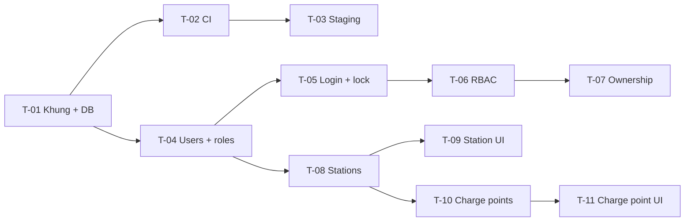

# Kế hoạch thực hiện Sprint 1

Sprint dài 5 ngày. Phạm vi, Acceptance Criteria, dependency và NFR của từng
backlog phải được đọc từ `.local/project-inputs/Backlog CSMS.xlsx`. Jira chỉ
dùng để kiểm tra giao việc và tiến độ hiện tại; không dùng danh sách task kỹ thuật để xác
định hoặc thu hẹp phạm vi. Quy trình thực hiện và kiểm chứng tuân theo
[`BACKLOG_DELIVERY_GUIDE.md`](BACKLOG_DELIVERY_GUIDE.md).

## Trình tự


```mermaid
flowchart LR
  T01[T-01 Khung + DB] --> T02[T-02 CI]
  T02 --> T03[T-03 Staging]
  T01 --> T04[T-04 Users + roles]
  T04 --> T05[T-05 Login + lock]
  T05 --> T06[T-06 RBAC]
  T06 --> T07[T-07 Ownership]
  T04 --> T08[T-08 Stations]
  T08 --> T09[T-09 Station UI]
  T08 --> T10[T-10 Charge points]
  T10 --> T11[T-11 Charge point UI]
```

## Phân bổ theo ngày

| Ngày | Mục tiêu | Tiêu chí kết thúc |
| --- | --- | --- |
| 1 | T-01, bắt đầu T-04 | Compose chạy; migration up/down; 5 roles được seed |
| 2 | T-02, T-05 | CI xanh; login đúng/sai; khoá tồn tại qua restart |
| 3 | T-06, T-07, T-08 | Route chưa khai quyền trả 403; owner A không đọc station B |
| 4 | T-09, T-10, T-11 | CRUD station; thêm trụ và connectors; unique code ở DB |
| 5 | hoàn thiện T-03, regression, demo | health check; test xanh; demo chạy từ môi trường sạch |

K-01 chạy timebox 2 ngày bởi hai người sau khi T-01 ổn định, không chặn luồng CRUD trạm.

## Definition of Done chung

- Mọi AC/NFR trong backlog có task nhỏ và bằng chứng `PASS`.
- Backend và frontend dùng API thật đã tích hợp end-to-end nếu backlog có UI.
- Migration tiến và lùi sạch trên database trống.
- Không có secret trong repository hoặc log.
- `lint`, `typecheck`, `test`, `build` đều xanh.
- README có lệnh chạy từ máy mới.
- Thay đổi có pull request, CI xanh, ít nhất một người review và không còn
  review comment chưa xử lý.

## Kịch bản demo Sprint 1

1. Khởi động từ môi trường sạch bằng Docker Compose.
2. Đăng nhập sai 5 lần; lần thứ 6 cho thấy tài khoản bị khoá tạm.
3. Đăng nhập bằng tài khoản chủ trạm mẫu.
4. Tạo một trạm với toạ độ hợp lệ, sửa tên và xem danh sách.
5. Thêm trụ với 2 đầu nối; thử lại cùng mã và nhận lỗi tại ô nhập.
6. Dùng tài khoản chủ trạm thứ hai gọi thẳng API của trạm vừa tạo; nhận 403 và kiểm tra security log.
7. Mở một route test chưa khai policy bằng admin; nhận 403.
8. Cho CI chạy và mở trang health của staging nếu hạ tầng đã được cấp.

### Kiểm tra ownership T-07 bằng curl

Chuẩn bị một session của chủ trạm A và UUID của station thuộc chủ trạm B. Chỉ dùng
tài khoản và dữ liệu local/demo; không ghi cookie thật vào tài liệu hoặc commit.

```powershell
$ownerASession = "<session-cookie-owner-A>"
$stationBId = "<station-id-owner-B>"

curl.exe -i `
  --cookie "session=$ownerASession" `
  "http://127.0.0.1:8001/api/v1/stations/$stationBId"
```

Kết quả mong đợi:

```text
HTTP/1.1 403 Forbidden
```

```json
{"detail":"permission_denied"}
```

Security log phải có event `cross_owner_station_access_denied` với actor ID và
station ID, nhưng không chứa email, password, session cookie, tên hoặc địa chỉ trạm.

Dùng một UUID station không tồn tại để phân biệt lỗi:

```powershell
$missingStationId = "00000000-0000-0000-0000-000000000000"

curl.exe -i `
  --cookie "session=$ownerASession" `
  "http://127.0.0.1:8001/api/v1/stations/$missingStationId"
```

Kết quả mong đợi là `404 Not Found` với:

```json
{"detail":"resource_not_found"}
```

