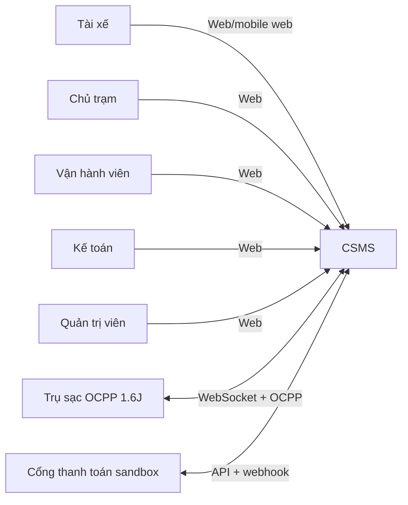
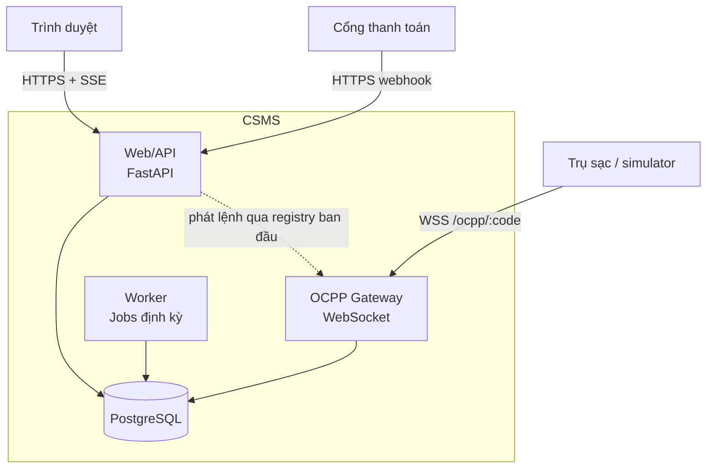
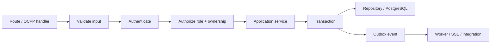
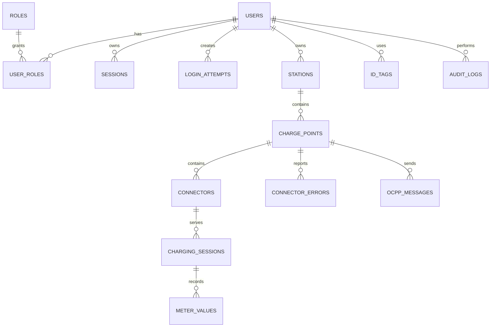

# Kiến trúc hệ thống CSMS

Trạng thái: đề xuất nền tảng, phiên bản 1.0  
Phạm vi: toàn bộ product backlog; phần triển khai đầu tiên được giới hạn ở Sprint 1.

## 1. Quyết định chính

CSMS bắt đầu bằng **modular monolith** viết bằng Python 3.12+. Ứng dụng HTTP, cổng OCPP và worker nằm trong cùng codebase nhưng có ba entry point riêng. Tất cả dùng chung các module nghiệp vụ và PostgreSQL.

Lựa chọn này giữ giao dịch, phân quyền và migration dễ hiểu cho nhóm mới, đồng thời tạo sẵn ranh giới để tách dịch vụ sau này nếu số kết nối hoặc tải nền tăng đáng kể.

| Thành phần | Lựa chọn | Trách nhiệm |
| --- | --- | --- |
| Web/API | FastAPI + Uvicorn | Trang web, REST API, phiên đăng nhập, RBAC, OpenAPI |
| ORM/validation | SQLAlchemy 2 + Pydantic | Transaction, truy vấn và kiểm tra dữ liệu vào/ra |
| OCPP gateway | FastAPI WebSocket + `ocpp` | Kết nối OCPP 1.6J, định tuyến message, lệnh xuống trụ |
| Worker | Tiến trình Python riêng | Offline detection, dọn dữ liệu, cảnh báo, đối soát |
| Dữ liệu | PostgreSQL | Nguồn dữ liệu duy nhất, giao dịch và ràng buộc |
| Realtime UI | Server-Sent Events | Đẩy trạng thái từ server xuống trình duyệt |
| Đóng gói | Docker Compose | Môi trường local và staging giống nhau |
| CI/CD | GitHub Actions | lint, typecheck, test, build, deploy có health check |

## 2. Sơ đồ ngữ cảnh



## 3. Sơ đồ container



Trong giai đoạn một tiến trình, Web/API và OCPP có thể nằm cùng container để registry kết nối sống trong bộ nhớ. Khi tách nhiều instance, registry và kênh lệnh phải chuyển sang hạ tầng dùng chung; đây là quyết định sau MVP.

## 4. Module nghiệp vụ

Mỗi module sở hữu route, service, repository, schema kiểm tra đầu vào và test của mình. Module chỉ truy cập dữ liệu module khác qua service công khai hoặc truy vấn đọc đã định nghĩa.

| Module | Trách nhiệm | Backlog chính |
| --- | --- | --- |
| `identity` | user, role, session, đăng nhập, khoá tạm | S-02, S-03, S-61 |
| `stations` | station, charge point, connector, quyền sở hữu | S-04, S-05, S-42, S-66 |
| `ocpp` | kết nối, frame, handlers, pending calls, chống trùng | S-06–S-16, S-60 |
| `charging` | phiên sạc, meter values, phục hồi, bất thường | S-17–S-25 |
| `pricing` | biểu giá, khung giờ, snapshot và tính tiền | S-28–S-34, S-65 |
| `wallet` | ví, sổ cái, nạp tiền, webhook | S-35–S-41 |
| `power` | hạn mức và phân bổ công suất | S-42–S-45 |
| `reservations` | tìm trạm, đặt chỗ, hết hạn | S-47–S-51 |
| `reporting` | doanh thu, đối soát, chia doanh thu, CSV | S-52–S-58 |
| `notifications` | cảnh báo vận hành và thông báo tài xế | S-46, S-59, S-63 |
| `audit` | nhật ký chỉ ghi thêm | S-27, S-56 |
| `privacy` | yêu cầu xoá/ẩn danh dữ liệu cá nhân | S-57 |

## 5. Luồng xử lý chuẩn



- Route HTTP mới không có metadata quyền sẽ trả 403.
- Repository của dữ liệu theo chủ sở hữu bắt buộc nhận `ActorScope`; không cho controller tự ghép điều kiện owner.
- Service điều phối transaction. Repository không tự commit.
- Sự kiện cần phát ra ngoài transaction được ghi vào outbox cùng transaction, rồi worker chuyển tiếp. Sprint 1 có thể chưa chạy dispatcher nhưng schema/ràng buộc không cản việc thêm sau.

## 6. Bảo mật và phân quyền

### Xác thực web

- Mật khẩu hash bằng Argon2id.
- Session id ngẫu nhiên nằm trong cookie `HttpOnly`, `Secure` ở staging/production, `SameSite=Lax`.
- Database chỉ lưu hash của session token để giảm hậu quả khi dữ liệu bị lộ.
- Session hết hạn trả 401 cho API; trang web chuyển về đăng nhập.
- Đăng nhập sai được đếm theo cả tài khoản và IP. Sau 5 lần sai liên tiếp, lần tiếp theo bị khoá 15 phút.
- Thông báo đăng nhập luôn là “Email hoặc mật khẩu không đúng”.

### Phân quyền

```text
request -> session -> user -> roles -> route policy -> ownership scope -> handler
```

Năm vai trò seed ban đầu: `driver`, `station_owner`, `operator`, `accountant`, `admin`.

- RBAC quyết định loại thao tác được phép.
- Ownership quyết định bản ghi cụ thể người dùng được thấy hoặc sửa.
- Admin không tự động vượt route chưa khai policy; nguyên tắc deny-by-default vẫn áp dụng.
- Mọi lần truy cập chéo quyền sở hữu bị từ chối và ghi security log không chứa dữ liệu nhạy cảm.

## 7. Mô hình dữ liệu lõi



Quy ước dữ liệu:

- Tên bảng/cột `snake_case`; khoá chính `id`; thời gian `timestamptz`.
- Mọi bảng mutable có `created_at`, `updated_at`.
- `users.email` được chuẩn hoá lowercase và unique.
- `charge_points.code` unique toàn hệ thống.
- `(charge_point_id, connector_number)` unique; connector number bắt đầu từ 1.
- Toạ độ dùng `numeric(9,6)` cho latitude và `numeric(10,6)` cho longitude trong MVP; có thể chuyển sang PostGIS khi truy vấn gần trở thành điểm nghẽn.
- Tiền lưu bằng số nguyên theo đơn vị tiền nhỏ nhất; điện năng lưu Wh, không dùng số thực.
- Ledger, audit log và dữ liệu đối soát dùng mô hình chỉ ghi thêm.

## 8. Cấu trúc repository đề xuất

```text
csms/
├─ src/
│  ├─ entrypoints/
│  │  ├─ http.py
│  │  ├─ ocpp.py
│  │  └─ worker.py
│  ├─ modules/
│  │  ├─ identity/
│  │  │  ├─ router.py
│  │  │  ├─ service.py
│  │  │  ├─ repository.py
│  │  │  ├─ schemas.py
│  │  │  └─ models.py
│  │  ├─ stations/
│  │  ├─ ocpp/
│  │  ├─ charging/
│  │  ├─ pricing/
│  │  ├─ wallet/
│  │  └─ audit/
│  ├─ platform/
│  │  ├─ auth/
│  │  ├─ database/
│  │  ├─ events/
│  │  ├─ logging/
│  │  └─ jobs/
│  ├─ web/
│  │  ├─ templates/
│  │  ├─ static/
│  │  └─ components/
│  └─ config.py
├─ migrations/
├─ seeds/
├─ tests/
│  ├─ unit/
│  ├─ integration/
│  └─ fixtures/
├─ scripts/
├─ docs/
├─ .github/workflows/
├─ Dockerfile
├─ docker-compose.yml
├─ pyproject.toml
└─ README.md
```

Phụ thuộc được phép: `entrypoints -> modules -> platform`. Module nghiệp vụ không import entrypoint/web và tránh import repository nội bộ của module khác. Mỗi request hoặc message OCPP sử dụng một `AsyncSession` riêng; không chia sẻ session giữa các coroutine đồng thời.

## 9. OCPP và tính nhất quán

- URL kết nối: `/ocpp/:chargePointCode`, subprotocol bắt buộc `ocpp1.6`.
- Mã trụ lấy từ path và tra DB; không tin mã trong payload.
- Parser hỗ trợ đúng ba frame `CALL`, `CALLRESULT`, `CALLERROR` trước khi thêm handler.
- `(charge_point_id, message_id)` là khoá chống xử lý lặp, lưu cả response đã trả.
- Handler nghiệp vụ và việc ghi response idempotency nằm trong cùng transaction.
- Một connector chỉ có tối đa một phiên mở bằng partial unique index.
- Khi trụ offline, không tự đóng phiên; trạng thái bất thường và quyết định đóng là hai bước riêng.
- Lệnh từ server xuống trụ dùng correlation id và timeout, không chặn luồng nhận message khác.

## 10. Realtime và job nền

- Trạng thái trình duyệt dùng SSE vì luồng chủ yếu một chiều, client tự reconnect và tải snapshot lại.
- Các job dùng PostgreSQL advisory lock để một job chỉ chạy trên một instance.
- Mốc thời gian nghiệp vụ so sánh bằng `now()` của PostgreSQL.
- Job phải idempotent và ghi log dạng cấu trúc có `job_name`, `run_id`, số bản ghi xử lý.

## 11. Triển khai và quan sát

Local dùng Compose với `app` và `db`. Staging dùng Docker image bất biến theo commit SHA.

Pipeline:

```text
push/PR -> install -> lint -> typecheck -> test -> build image
main -> push image -> start candidate -> migrate -> health check -> switch -> keep previous image
```

Health endpoints:

- `/health/live`: tiến trình còn sống, không truy cập dependency.
- `/health/ready`: kiểm tra DB và migration version.

Log dùng JSON, có request/correlation id; tuyệt đối không log mật khẩu, session token, connection string hoặc toàn bộ id tag. Backup/restore phải được kiểm thử trước khi đưa thanh toán thật vào hệ thống.

## 12. Phạm vi Sprint 1

Sprint 1 tạo một lát cắt chạy xuyên suốt:

```text
Docker/CI -> migration -> user/session -> deny-by-default RBAC
          -> owner-scoped station -> charge point + connectors -> demo
```

| Nhóm việc | Task thực hiện | Đầu ra kiểm chứng |
| --- | --- | --- |
| Setup dự án | T-01, T-02, khung T-03 | Compose chạy app + DB; CI lint/test/build; tài liệu deploy staging |
| Quy ước làm việc | README, CONTRIBUTING, PR template | Quy tắc branch, commit, review và lệnh chạy thống nhất |
| Cơ sở dữ liệu | T-04, T-08, T-10 | Migration up/down và seed dữ liệu demo |
| Đăng nhập/phân quyền | T-05, T-06, T-07 | Khoá 15 phút, cookie session, RBAC và ownership test |
| Màn hình đầu tiên | T-09, T-11 | Tạo/sửa/list trạm; thêm trụ và 1–4 đầu nối |
| Chuẩn bị demo | script + checklist | Kịch bản login, tạo trạm, thêm trụ, thử truy cập chéo |

T-03 chỉ hoàn tất phần triển khai thật khi có GitHub repository, secrets và máy chủ staging. K-01 là spike song song, đầu ra là tài liệu kỹ thuật và bản ghi simulator; không đưa mã thử của spike vào mã sản phẩm.

## 13. Điều kiện xem lại kiến trúc

Chỉ cân nhắc tách service khi có số đo cho thấy một trong các điều kiện sau:

- cần nhiều instance OCPP nhưng registry trong bộ nhớ không còn đúng;
- job nền ảnh hưởng độ trễ message OCPP;
- chu kỳ triển khai của thanh toán/OCPP phải độc lập;
- tải kết nối hoặc dữ liệu vượt khả năng scale dọc của một PostgreSQL/ứng dụng.

Trước các ngưỡng đó, giữ ranh giới module và test contract đem lại phần lớn lợi ích với ít chi phí vận hành hơn microservices.
